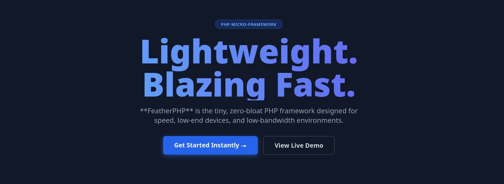

---

<h1 align="center">FeatherPHP</h1>
---


---

<p align="center">
  Tiny, dependency-free PHP micro-framework built for speed and simplicity.
</p>

---

---
### ⚙️ Quick Start

```bash
composer serve
```

```
FeatherPHP/
├── core/
│   ├── Router.php
│   ├── Http.php
│   └── Engine.php
├── public/
│   └── index.php
├── views/
│   └── landing.php
└── icons/
    └── feather-logo.png

```

